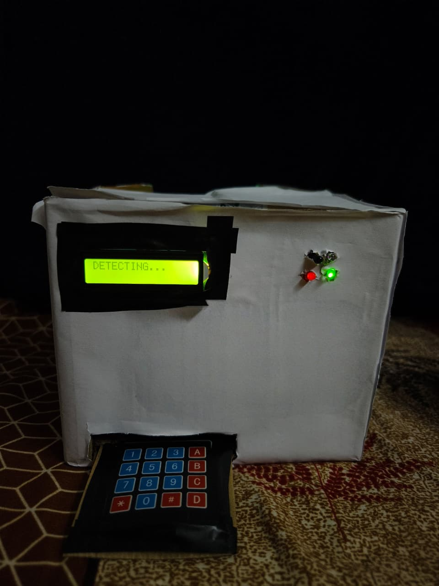
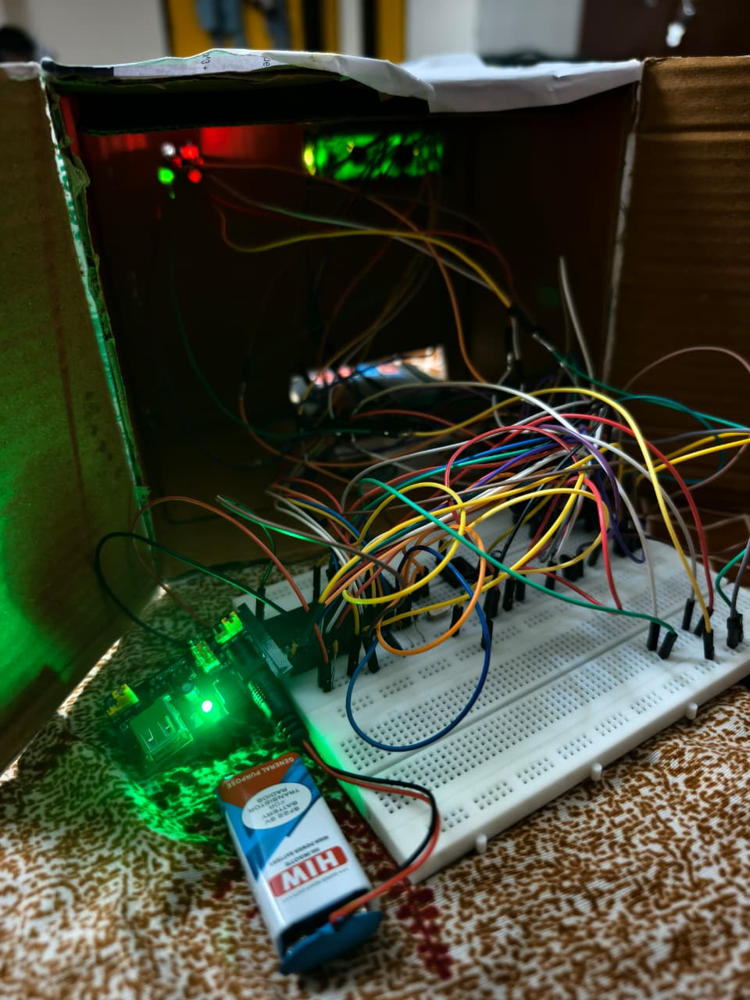
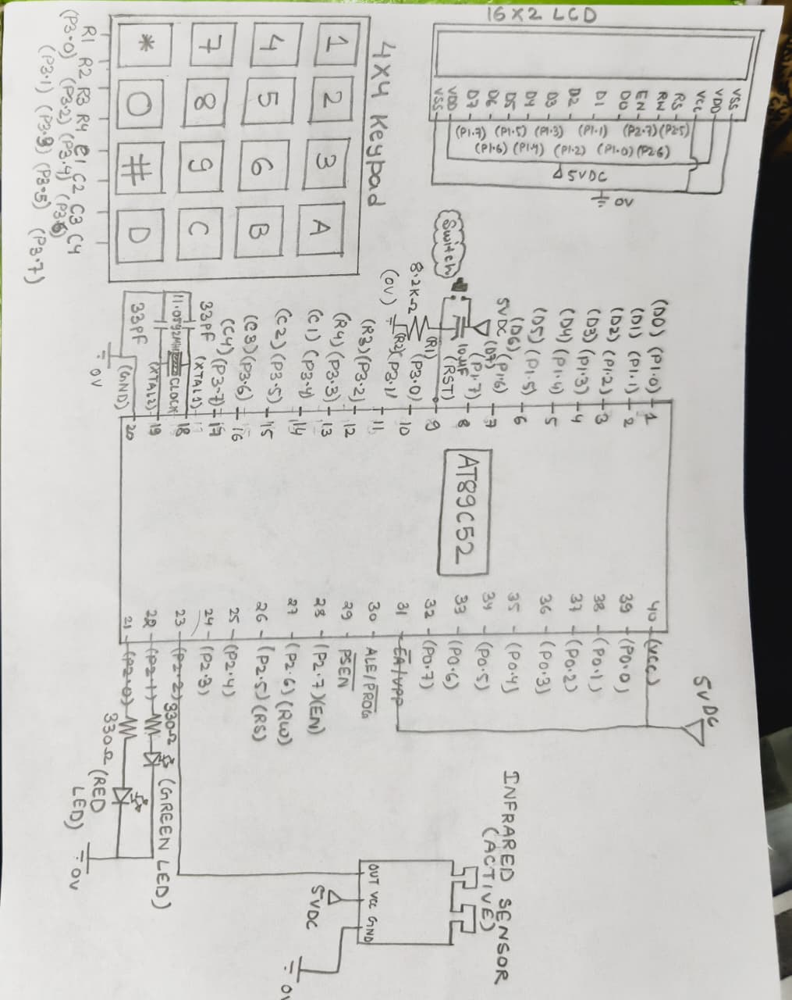

# SecureBank Embedded Terminal

## Overview

SecureBank Embedded Terminal is an embedded banking simulation system developed using the AT89C52 (8051) microcontroller. The project demonstrates secure user authentication through an infrared sensor and keypad-based PIN verification while providing basic banking operations on a 16×2 LCD.

## Project Photos

### Front View

### Internal Hardware

### Circuit Diagram

---

## Features

- IR Sensor based user detection
- PIN Authentication
- Secure Login
- Balance Inquiry
- Cash Deposit
- Cash Withdrawal
- LCD Display Interface
- Status LEDs for system indication

---

## Hardware Used

- AT89C52 (8051) Microcontroller
- 16×2 LCD Display
- 4×4 Keypad
- IR Sensor
- LEDs
- Buzzer
- Power Supply
- Connecting Wires and Supporting Components

---

## Software Used

- Assembly Language
- Keil µVision
- Proteus / Embedded Hardware Testing

---

## System Working

1. The IR sensor detects the presence of a user.
2. The system prompts the user to enter a PIN through the keypad.
3. The entered PIN is verified by the 8051 microcontroller.
4. After successful authentication, the user can access banking operations.
5. The available operations include balance inquiry, cash deposit, and cash withdrawal.
6. The LCD provides instructions and system status to the user.
7. LEDs provide additional system status indication.

---

## Project Files

| File | Description |
|---|---|
| `SecureBank.asm` | Main 8051 Assembly source code |
| `bank.hex` | Compiled HEX file |
| `bank.uvproj` | Keil project file |
| `Circuit_diagram.jpeg` | Circuit diagram |
| `Front_View.jpeg` | Front view of the completed system |
| `Internal_Hardware.jpeg` | Internal hardware implementation |

---

## Key Learning Outcomes

- 8051 microcontroller programming
- Assembly language programming
- GPIO interfacing
- LCD interfacing
- Keypad interfacing
- IR sensor integration
- User authentication logic
- Embedded system design and debugging

---

## Project Status

Completed as an embedded systems project demonstrating a secure banking terminal using the 8051 microcontroller.
